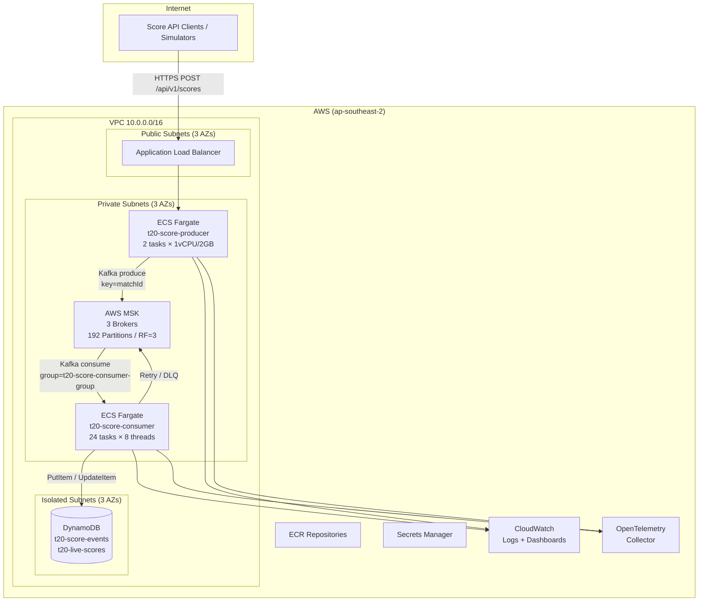

# T20 Live Scoring – Architecture Diagram

> **Status:** Placeholder – will be completed in TASK-16.1

## System Architecture

## Key Design Decisions

| Decision | Choice | Rationale |
|----------|--------|-----------|
| Message key | `matchId` | Guarantees per-match ordering on same partition |
| Partitions | 192 | ~1.5× peak concurrent matches (120), power-of-2 friendliness |
| Consumer threads | 192 (24 pods × 8) | 1:1 mapping with partitions |
| Replication | RF=3, min.insync=2 | Survives 1 AZ failure |
| Storage | DynamoDB PAY_PER_REQUEST | No capacity planning, scales with burst traffic |
