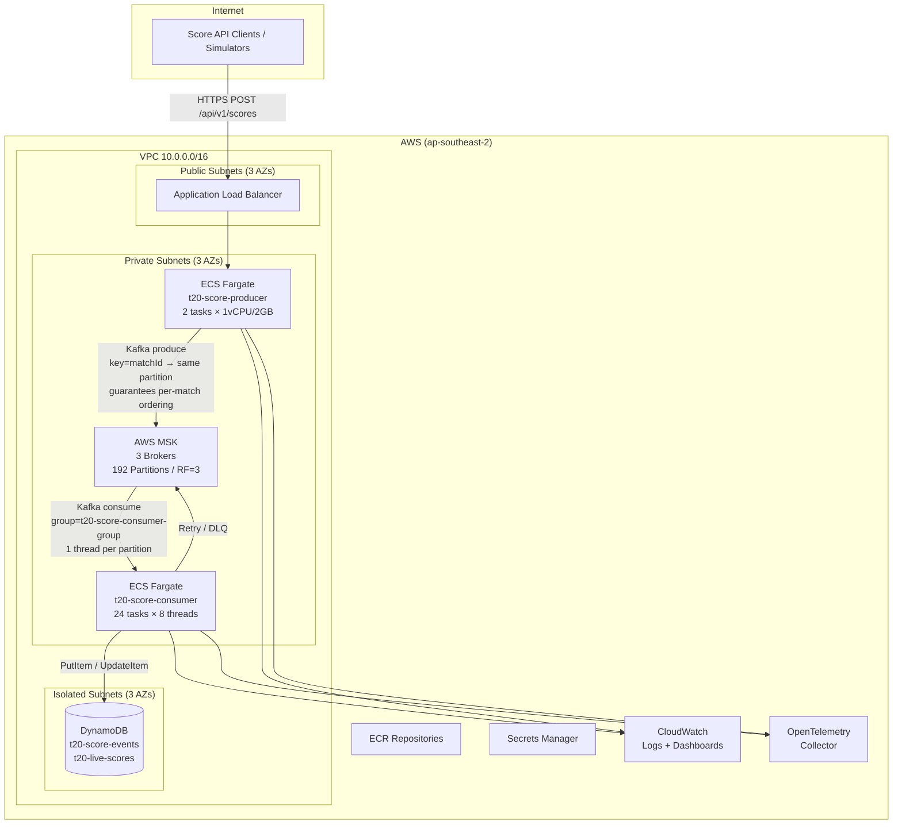
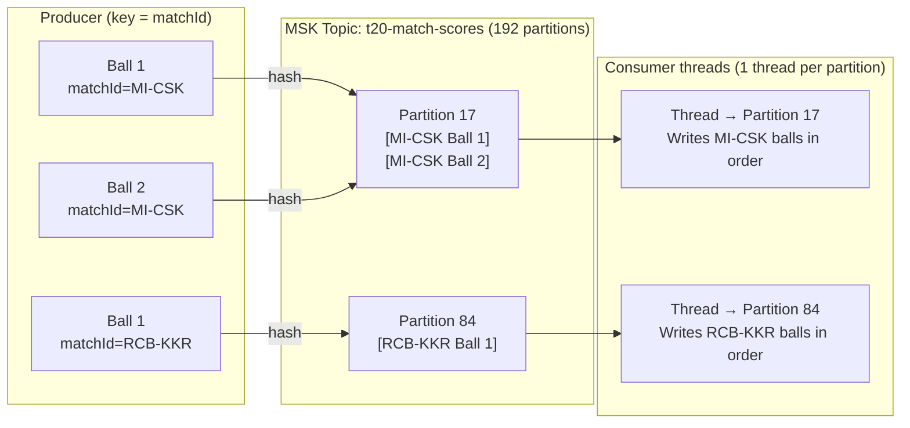

# T20 Live Scoring – Architecture Diagram

## System Architecture



---

## Kafka Partitioning Strategy

### Why `matchId` is the Partition Key

Kafka only guarantees message ordering **within a single partition**. All balls for the same match must land on the same partition so the consumer can write them to DynamoDB in strict delivery order (Ball 1 → Ball 2 → Ball 3).



### Single Partition vs matchId Key — Comparison

| | Single Partition + Filter | `matchId` as Partition Key ✅ |
|---|---|---|
| **Ordering guarantee** | ❌ None across concurrent matches | ✅ Strict per-match order guaranteed |
| **Parallelism** | ❌ One consumer thread handles all matches serially | ✅ Each match processed on its own independent thread |
| **Throughput** | ❌ 8 simultaneous matches queue behind each other | ✅ 8 matches processed fully in parallel |
| **Isolation** | ❌ Slow DynamoDB write on one match delays all others | ✅ One match's retry never affects another match |
| **Retry safety** | ❌ Retries can interleave with original messages, reordering balls | ✅ Retries hash to the same partition, preserving order |
| **DynamoDB consistency** | ❌ Ball 3 may commit before Ball 1, corrupting live score view | ✅ `AckMode.RECORD` ensures Ball N+1 only starts after Ball N is written |

### Why "Filter by matchId" Doesn't Work

#### ❌ Problem — Single Partition, Thread Pool (race condition)

The consumer polls a batch and hands all messages to a thread pool simultaneously. DynamoDB writes are network I/O — completion order is **non-deterministic**:

```
Time  0ms  Thread pool picks up Ball 1, Ball 2, Ball 3 at the same time
           Worker 1 → Ball 1 DynamoDB write starts  (takes 50ms, slow network)
           Worker 2 → Ball 2 DynamoDB write starts  (takes 15ms, fast)
           Worker 3 → Ball 3 DynamoDB write starts  (takes 20ms, fast)

Time 15ms  Ball 2 committed to DynamoDB ✓
Time 20ms  Ball 3 committed to DynamoDB ✓
Time 25ms  Viewer reads live score → totalRuns is WRONG (Ball 1's run not yet added)
Time 50ms  Ball 1 committed to DynamoDB ✓  (too late — viewer already got wrong score)
```

> **Note:** The event store (`t20-score-events`) is NOT corrupted — it stores one item per ball with `eventSequence` as the sort key, so querying by `inning#over#ball` always returns events in the correct order regardless of write order.
>
> **What IS affected is the live score materialized view** (`t20-live-scores`).

**Why the materialized view breaks:** `t20-live-scores` holds one item per match with running totals updated via DynamoDB `UpdateExpression`:

```
UpdateExpression: "ADD totalRuns :runs"   ← incremental, applied in write order
```

If Ball 3's update runs before Ball 1's:

```
Time 15ms  Ball 2 update: totalRuns += 4  →  totalRuns = 4
Time 20ms  Ball 3 update: totalRuns += 6  →  totalRuns = 10  ← viewer sees this (Ball 1's +1 MISSING)
Time 50ms  Ball 1 update: totalRuns += 1  →  totalRuns = 11  ← correct, but too late
```

There is also a **retry double-increment risk**: if Ball 1's write fails and retries after Ball 2 and Ball 3 already committed their Kafka offsets, Ball 1 might be re-processed. Without complex idempotency guards on every `UpdateExpression`, `totalRuns` could be incremented twice for Ball 1.

#### ✅ Fix — `matchId` Partition Key + `AckMode.RECORD` + Single Thread

When all balls of a match go to **one partition** assigned to **one thread**, and `AckMode.RECORD` makes the thread **block** until each DynamoDB write completes before moving on:

```
Time  0ms  Thread 17 polls Partition 17 → gets [Ball 1, Ball 2, Ball 3]
           → processes Ball 1 → DynamoDB write → BLOCKS (AckMode.RECORD)

Time 50ms  Ball 1 write DONE ✓ → offset committed
           → NOW processes Ball 2 → DynamoDB write → BLOCKS

Time 65ms  Ball 2 write DONE ✓ → offset committed
           → NOW processes Ball 3 → DynamoDB write → BLOCKS

Time 85ms  Ball 3 write DONE ✓ → offset committed
```

> **Result:** `t20-live-scores.totalRuns` is always correct at every point in time. The viewer at `Time 25ms` would not yet see Ball 2 or Ball 3 — they'd see Ball 1 only, which is the correct partial state.

The two guarantees that make this work:
1. **`matchId` partition key** → all balls of a match go to the same partition, consumed by one thread
2. **`AckMode.RECORD` + `enable-auto-commit: false`** → thread does not move to Ball N+1 until Ball N is fully written and offset committed — making retries impossible to create duplicate increments

### Why Not 1 Partition + 1 Consumer?

One partition with one consumer **does guarantee ordering** — it's the simplest correct design. The problem is **throughput and horizontal scaling**.

#### ❌ Problem 1 — All Matches Queue Serially

With 8 simultaneous IPL matches and a single partition:

```
[MI Ball 1] → write 50ms → [CSK Ball 1] → write 50ms → [RCB Ball 1] → write 50ms → ...
```

All 8 matches block behind each other on one thread. A slow DynamoDB write for one match delays score updates for **all other matches**. Viewers watching RCB vs KKR wait because the MI vs CSK thread is busy.

#### ❌ Problem 2 — Consumer Cannot Scale Out

In Kafka, **you can have at most as many active consumers in a group as there are partitions**. With 1 partition:

```
Consumer Task 1 → assigned Partition 0  (active, doing all the work)
Consumer Task 2 → NO partition available → sits completely IDLE
Consumer Task 3 → NO partition available → sits completely IDLE
```

Adding more ECS tasks does nothing. You can never scale horizontally beyond one thread.

#### Comparison

| | 1 Partition, 1 Consumer | 192 Partitions, 192 Threads |
|---|---|---|
| **Ordering guarantee** | ✅ Guaranteed | ✅ Guaranteed per match |
| **8 simultaneous matches** | ❌ All queue serially on one thread | ✅ All processed in parallel |
| **Scale out (add ECS tasks)** | ❌ Impossible — extra consumers sit idle | ✅ Add tasks → more throughput |
| **One slow match affects others** | ❌ Stalls the entire queue | ✅ Each match is fully isolated |
| **Throughput ceiling** | ❌ ~1 DynamoDB write at a time | ✅ 192 DynamoDB writes simultaneously |

> With 192 partitions, each match gets its own partition and its own thread. Ordering is still guaranteed **per match**, but all matches run fully in parallel — the best of both worlds.

### Partition Count Rationale

```
192 partitions = 24 ECS consumer tasks × 8 listener threads per task
               = ~1.6× peak concurrent IPL matches (~120 matches/day peak)
```

- **1:1 thread-to-partition mapping** — no idle threads, no partition contention
- **Kafka's default partitioner** (`murmur2` hash of `matchId`) distributes matches evenly across all 192 partitions
- **Rebalance cost is low** — `CooperativeStickyAssignor` used in prod to avoid stop-the-world rebalances on rolling deploys

---


## Key Design Decisions

| Decision | Choice | Rationale |
|----------|--------|-----------|
| Message key | `matchId` | Guarantees per-match ordering — all balls of a match land on one partition and are processed by one thread in sequence |
| Partitions | 192 | 24 consumer tasks × 8 threads = 192 concurrent processors; ~1.6× peak load headroom |
| Consumer threads | 192 (24 pods × 8) | 1:1 mapping with partitions — no idle capacity, no contention |
| Replication | RF=3, min.insync=2 | Survives 1 AZ failure without data loss |
| Isolation level | `read_committed` | Consumer only reads producer-committed messages — pairs with `enable.idempotence=true` on producer |
| ACK mode | `AckMode.RECORD` | Offset committed only after DynamoDB write succeeds — no message dropped silently |
| Rebalance strategy | `CooperativeStickyAssignor` | Rolling deploys don't pause all partition consumption; only reassigned partitions pause |
| Static membership | `group.instance.id` set | Consumer pod restart within `session.timeout.ms` rejoins without triggering a rebalance |
| Storage | DynamoDB PAY_PER_REQUEST | No capacity planning, scales elastically with burst traffic during popular matches |
