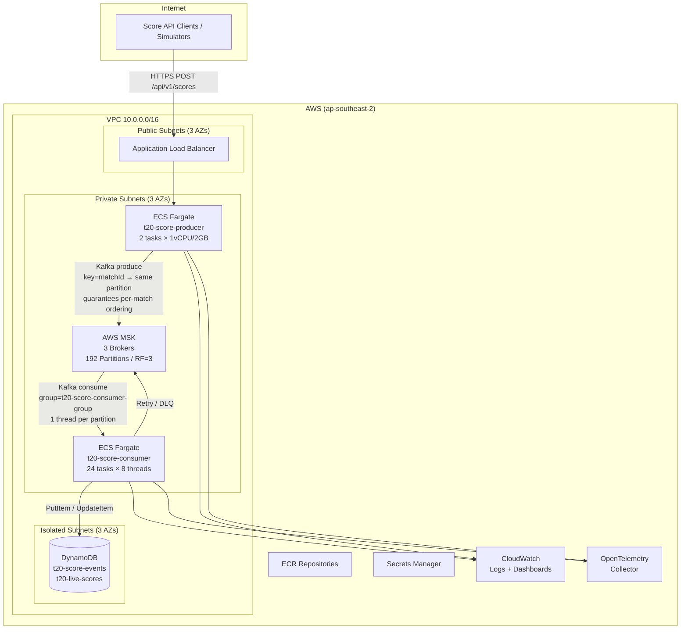
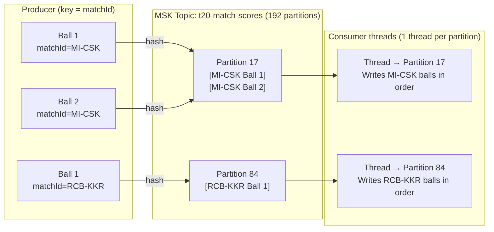

# T20 Live Scoring – Architecture Diagram

## System Architecture



---

## Kafka Partitioning Strategy

### Why `matchId` is the Partition Key

Kafka only guarantees message ordering **within a single partition**. All balls for the same match must land on the same partition so the consumer can write them to DynamoDB in strict delivery order (Ball 1 → Ball 2 → Ball 3).



### Single Partition vs matchId Key — Comparison

| | Single Partition + Filter | `matchId` as Partition Key ✅ |
|---|---|---|
| **Ordering guarantee** | ❌ None across concurrent matches | ✅ Strict per-match order guaranteed |
| **Parallelism** | ❌ One consumer thread handles all matches serially | ✅ Each match processed on its own independent thread |
| **Throughput** | ❌ 8 simultaneous matches queue behind each other | ✅ 8 matches processed fully in parallel |
| **Isolation** | ❌ Slow DynamoDB write on one match delays all others | ✅ One match's retry never affects another match |
| **Retry safety** | ❌ Retries can interleave with original messages, reordering balls | ✅ Retries hash to the same partition, preserving order |
| **DynamoDB consistency** | ❌ Ball 3 may commit before Ball 1, corrupting live score view | ✅ `AckMode.RECORD` ensures Ball N+1 only starts after Ball N is written |

### Why "Filter by matchId" Doesn't Work

Even if you filtered in the consumer code, multiple consumer threads would pick up messages for the same match concurrently (from a single partition or different partitions), and DynamoDB writes would race:

```
Ball 1 write starts (50ms latency) →
Ball 2 write starts immediately (parallel) →
Ball 3 write starts immediately (parallel) →
Ball 3 commits ✓  Ball 2 commits ✓  Ball 1 commits ✓  ← wrong order in DynamoDB
```

Live score view would read incorrect totals mid-match. The `matchId` partition key + single-thread-per-partition prevents this entirely.

### Partition Count Rationale

```
192 partitions = 24 ECS consumer tasks × 8 listener threads per task
               = ~1.6× peak concurrent IPL matches (~120 matches/day peak)
```

- **1:1 thread-to-partition mapping** — no idle threads, no partition contention
- **Kafka's default partitioner** (`murmur2` hash of `matchId`) distributes matches evenly across all 192 partitions
- **Rebalance cost is low** — `CooperativeStickyAssignor` used in prod to avoid stop-the-world rebalances on rolling deploys

---

## Key Design Decisions

| Decision | Choice | Rationale |
|----------|--------|-----------|
| Message key | `matchId` | Guarantees per-match ordering — all balls of a match land on one partition and are processed by one thread in sequence |
| Partitions | 192 | 24 consumer tasks × 8 threads = 192 concurrent processors; ~1.6× peak load headroom |
| Consumer threads | 192 (24 pods × 8) | 1:1 mapping with partitions — no idle capacity, no contention |
| Replication | RF=3, min.insync=2 | Survives 1 AZ failure without data loss |
| Isolation level | `read_committed` | Consumer only reads producer-committed messages — pairs with `enable.idempotence=true` on producer |
| ACK mode | `AckMode.RECORD` | Offset committed only after DynamoDB write succeeds — no message dropped silently |
| Rebalance strategy | `CooperativeStickyAssignor` | Rolling deploys don't pause all partition consumption; only reassigned partitions pause |
| Static membership | `group.instance.id` set | Consumer pod restart within `session.timeout.ms` rejoins without triggering a rebalance |
| Storage | DynamoDB PAY_PER_REQUEST | No capacity planning, scales elastically with burst traffic during popular matches |
