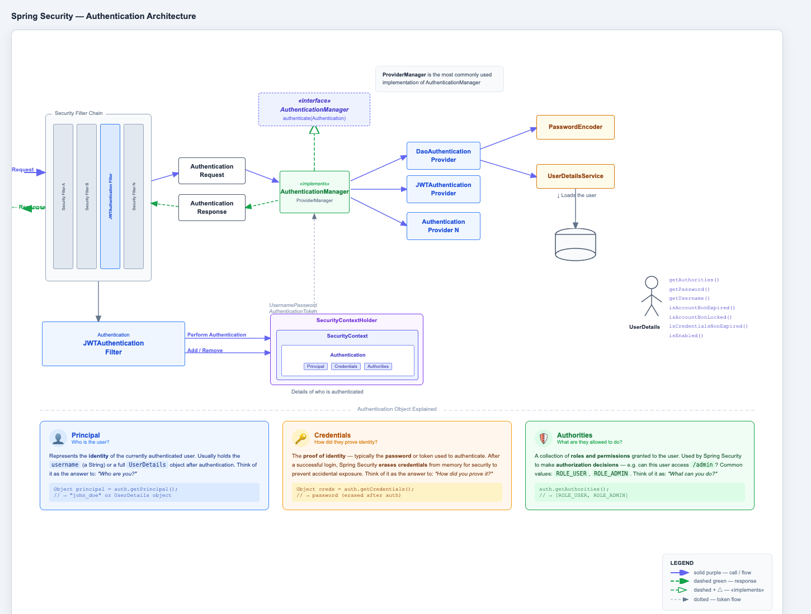
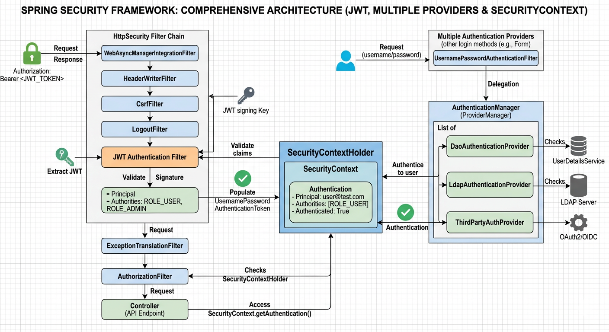
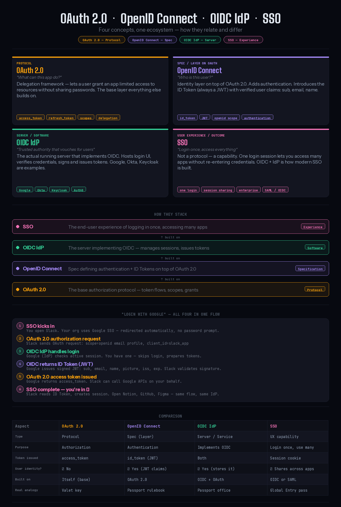

# Spring Security Interview Questions & Answers

> **Note on Spring Boot 3 / Spring Security 6**: All examples in this document use modern Spring Security 6 syntax. This includes the use of lambda DSLs (e.g., `http.authorizeHttpRequests(auth -> ...)` instead of `http.authorizeRequests()`) and the replacement of the deprecated `antMatchers` with `requestMatchers`. The old `WebSecurityConfigurerAdapter` has been removed in favor of registering a `SecurityFilterChain` bean.

## Core Security Concepts

### 1. What is Spring Security and what are its key features?

**Answer:**
Spring Security is a powerful authentication and authorization framework for Java applications.

**Key Features:**
- Comprehensive authentication and authorization
- Protection against common attacks (CSRF, Session Fixation, Clickjacking)
- Integration with various authentication mechanisms
- Method-level security
- Remember-me authentication
- LDAP integration
- OAuth2 and OpenID Connect support

```java
@Configuration
@EnableWebSecurity
public class SecurityConfig {
    
    @Bean
    public SecurityFilterChain filterChain(HttpSecurity http) throws Exception {
        http
            .authorizeHttpRequests(auth -> auth
                .requestMatchers("/public/**").permitAll()
                .requestMatchers("/admin/**").hasRole("ADMIN")
                .requestMatchers("/user/**").hasAnyRole("USER", "ADMIN")
                .anyRequest().authenticated()
            )
            .formLogin(form -> form
                .loginPage("/login")
                .defaultSuccessUrl("/dashboard")
                .permitAll()
            )
            .logout(logout -> logout
                .logoutSuccessUrl("/login?logout")
                .permitAll()
            )
            .csrf(csrf -> csrf.csrfTokenRepository(CookieCsrfTokenRepository.withHttpOnlyFalse()));
            
        return http.build();
    }
}
```

### 2. Explain the Spring Security architecture and filter chain

**Answer:**
Spring Security uses a chain of filters to process security concerns. 

👉 **Interactive Diagram:** [View full HTML interactive version](spring-security-diagram.html) 
Below is the visual overview of the Spring Security Authentication Architecture:





**Key Components:**

```java
// Security Filter Chain Order
1. SecurityContextPersistenceFilter - Establishes SecurityContext
2. LogoutFilter - Handles logout requests
3. UsernamePasswordAuthenticationFilter - Processes login form
4. BasicAuthenticationFilter - Processes HTTP Basic authentication
5. RequestCacheAwareFilter - Restores saved requests
6. SecurityContextHolderAwareRequestFilter - Wraps request
7. AnonymousAuthenticationFilter - Populates anonymous authentication
8. SessionManagementFilter - Manages sessions
9. ExceptionTranslationFilter - Handles security exceptions
10. FilterSecurityInterceptor - Authorizes requests

// Custom filter
@Component
public class CustomAuthenticationFilter extends OncePerRequestFilter {
    
    @Override
    protected void doFilterInternal(HttpServletRequest request, 
                                   HttpServletResponse response, 
                                   FilterChain filterChain) throws ServletException, IOException {
        String token = request.getHeader("X-Auth-Token");
        
        if (token != null && validateToken(token)) {
            Authentication auth = getAuthentication(token);
            SecurityContextHolder.getContext().setAuthentication(auth);
        }
        
        filterChain.doFilter(request, response);
    }
    
    private boolean validateToken(String token) {
        // Token validation logic
        return true;
    }
    
    private Authentication getAuthentication(String token) {
        // Extract user details from token
        UserDetails userDetails = loadUserFromToken(token);
        return new UsernamePasswordAuthenticationToken(
            userDetails, null, userDetails.getAuthorities());
    }
}

// Register custom filter
@Configuration
@EnableWebSecurity
public class SecurityConfig {
    
    @Bean
    public SecurityFilterChain filterChain(HttpSecurity http, 
                                          CustomAuthenticationFilter customFilter) throws Exception {
        http
            .addFilterBefore(customFilter, UsernamePasswordAuthenticationFilter.class)
            .authorizeHttpRequests(auth -> auth.anyRequest().authenticated());
            
        return http.build();
    }
}
```

### 3. How do you implement custom authentication in Spring Security?

**Answer:**
Custom authentication requires implementing UserDetailsService and AuthenticationProvider.

```java
// Custom UserDetailsService
@Service
public class CustomUserDetailsService implements UserDetailsService {
    
    private final UserRepository userRepository;
    
    @Override
    public UserDetails loadUserByUsername(String username) throws UsernameNotFoundException {
        User user = userRepository.findByUsername(username)
            .orElseThrow(() -> new UsernameNotFoundException("User not found: " + username));
            
        return org.springframework.security.core.userdetails.User.builder()
            .username(user.getUsername())
            .password(user.getPassword())
            .authorities(getAuthorities(user.getRoles()))
            .accountExpired(!user.isAccountNonExpired())
            .accountLocked(!user.isAccountNonLocked())
            .credentialsExpired(!user.isCredentialsNonExpired())
            .disabled(!user.isEnabled())
            .build();
    }
    
    private Collection<? extends GrantedAuthority> getAuthorities(Set<Role> roles) {
        return roles.stream()
            .map(role -> new SimpleGrantedAuthority("ROLE_" + role.getName()))
            .collect(Collectors.toList());
    }
}

// Custom AuthenticationProvider
@Component
public class CustomAuthenticationProvider implements AuthenticationProvider {
    
    private final CustomUserDetailsService userDetailsService;
    private final PasswordEncoder passwordEncoder;
    
    @Override
    public Authentication authenticate(Authentication authentication) 
            throws AuthenticationException {
        String username = authentication.getName();
        String password = authentication.getCredentials().toString();
        
        UserDetails user = userDetailsService.loadUserByUsername(username);
        
        if (!passwordEncoder.matches(password, user.getPassword())) {
            throw new BadCredentialsException("Invalid password");
        }
        
        // Additional custom validation
        if (!isValidUser(user)) {
            throw new DisabledException("User account is disabled");
        }
        
        return new UsernamePasswordAuthenticationToken(
            user, password, user.getAuthorities());
    }
    
    @Override
    public boolean supports(Class<?> authentication) {
        return UsernamePasswordAuthenticationToken.class.isAssignableFrom(authentication);
    }
    
    private boolean isValidUser(UserDetails user) {
        // Custom validation logic
        return user.isEnabled() && user.isAccountNonLocked();
    }
}

// Configuration
@Configuration
@EnableWebSecurity
public class SecurityConfig {
    
    @Bean
    public SecurityFilterChain filterChain(HttpSecurity http) throws Exception {
        http
            .authenticationProvider(customAuthenticationProvider)
            .authorizeHttpRequests(auth -> auth.anyRequest().authenticated())
            .formLogin(Customizer.withDefaults());
            
        return http.build();
    }
    
    @Bean
    public PasswordEncoder passwordEncoder() {
        return new BCryptPasswordEncoder();
    }
}
```

### 4. Explain method-level security in Spring

**Answer:**
Method-level security allows securing individual methods using annotations.

```java
// Enable method security
@Configuration
@EnableMethodSecurity(prePostEnabled = true, securedEnabled = true, jsr250Enabled = true)
public class MethodSecurityConfig {
}

// Service with method security
@Service
public class UserService {
    
    // Pre-authorization
    @PreAuthorize("hasRole('ADMIN')")
    public void deleteUser(Long userId) {
        userRepository.deleteById(userId);
    }
    
    // Check if user owns the resource
    @PreAuthorize("hasRole('USER') and #userId == authentication.principal.id")
    public User updateUser(Long userId, User user) {
        return userRepository.save(user);
    }
    
    // Post-authorization
    @PostAuthorize("returnObject.username == authentication.principal.username")
    public User getUserDetails(Long userId) {
        return userRepository.findById(userId).orElseThrow();
    }
    
    // Filter collection before returning
    @PostFilter("filterObject.owner == authentication.principal.username")
    public List<Document> getDocuments() {
        return documentRepository.findAll();
    }
    
    // Filter method arguments
    @PreFilter("filterObject.owner == authentication.principal.username")
    public void deleteDocuments(List<Document> documents) {
        documentRepository.deleteAll(documents);
    }
    
    // @Secured annotation
    @Secured({"ROLE_ADMIN", "ROLE_MANAGER"})
    public void approveOrder(Long orderId) {
        orderRepository.updateStatus(orderId, "APPROVED");
    }
    
    // JSR-250 annotations
    @RolesAllowed("ADMIN")
    public void systemConfiguration() {
        // Admin only
    }
    
    @PermitAll
    public List<Product> getProducts() {
        return productRepository.findAll();
    }
    
    @DenyAll
    public void restrictedMethod() {
        // No one can access
    }
}

// Custom security expression
@Component("customSecurity")
public class CustomSecurityExpression {
    
    public boolean isOwner(Long resourceId, Authentication authentication) {
        UserDetails user = (UserDetails) authentication.getPrincipal();
        Resource resource = resourceRepository.findById(resourceId).orElse(null);
        return resource != null && resource.getOwner().equals(user.getUsername());
    }
}

@Service
public class DocumentService {
    
    @PreAuthorize("@customSecurity.isOwner(#documentId, authentication)")
    public void deleteDocument(Long documentId) {
        documentRepository.deleteById(documentId);
    }
}
```

### 5. How do you implement JWT authentication in Spring Security?

**Answer:**
JWT (JSON Web Token) authentication requires token generation, validation, and filter configuration.

```java
// JWT Utility
@Component
public class JwtTokenUtil {
    
    @Value("${jwt.secret}")
    private String secret;
    
    @Value("${jwt.expiration}")
    private Long expiration;
    
    public String generateToken(UserDetails userDetails) {
        Map<String, Object> claims = new HashMap<>();
        claims.put("authorities", userDetails.getAuthorities());
        
        return Jwts.builder()
            .setClaims(claims)
            .setSubject(userDetails.getUsername())
            .setIssuedAt(new Date())
            .setExpiration(new Date(System.currentTimeMillis() + expiration * 1000))
            .signWith(SignatureAlgorithm.HS512, secret)
            .compact();
    }
    
    public String getUsernameFromToken(String token) {
        return getClaimFromToken(token, Claims::getSubject);
    }
    
    public Date getExpirationDateFromToken(String token) {
        return getClaimFromToken(token, Claims::getExpiration);
    }
    
    public <T> T getClaimFromToken(String token, Function<Claims, T> claimsResolver) {
        final Claims claims = getAllClaimsFromToken(token);
        return claimsResolver.apply(claims);
    }
    
    private Claims getAllClaimsFromToken(String token) {
        return Jwts.parser()
            .setSigningKey(secret)
            .parseClaimsJws(token)
            .getBody();
    }
    
    public Boolean validateToken(String token, UserDetails userDetails) {
        final String username = getUsernameFromToken(token);
        return (username.equals(userDetails.getUsername()) && !isTokenExpired(token));
    }
    
    private Boolean isTokenExpired(String token) {
        final Date expiration = getExpirationDateFromToken(token);
        return expiration.before(new Date());
    }
}

// JWT Authentication Filter
@Component
public class JwtAuthenticationFilter extends OncePerRequestFilter {
    
    private final JwtTokenUtil jwtTokenUtil;
    private final UserDetailsService userDetailsService;
    
    @Override
    protected void doFilterInternal(HttpServletRequest request, 
                                   HttpServletResponse response, 
                                   FilterChain chain) throws ServletException, IOException {
        final String requestTokenHeader = request.getHeader("Authorization");
        
        String username = null;
        String jwtToken = null;
        
        if (requestTokenHeader != null && requestTokenHeader.startsWith("Bearer ")) {
            jwtToken = requestTokenHeader.substring(7);
            try {
                username = jwtTokenUtil.getUsernameFromToken(jwtToken);
            } catch (IllegalArgumentException e) {
                logger.error("Unable to get JWT Token");
            } catch (ExpiredJwtException e) {
                logger.error("JWT Token has expired");
            }
        }
        
        if (username != null && SecurityContextHolder.getContext().getAuthentication() == null) {
            UserDetails userDetails = userDetailsService.loadUserByUsername(username);
            
            if (jwtTokenUtil.validateToken(jwtToken, userDetails)) {
                UsernamePasswordAuthenticationToken authToken = 
                    new UsernamePasswordAuthenticationToken(
                        userDetails, null, userDetails.getAuthorities());
                authToken.setDetails(new WebAuthenticationDetailsSource().buildDetails(request));
                SecurityContextHolder.getContext().setAuthentication(authToken);
            }
        }
        
        chain.doFilter(request, response);
    }
}

// Authentication Controller
@RestController
@RequestMapping("/api/auth")
public class AuthenticationController {
    
    private final AuthenticationManager authenticationManager;
    private final JwtTokenUtil jwtTokenUtil;
    private final UserDetailsService userDetailsService;
    
    @PostMapping("/login")
    public ResponseEntity<?> createAuthenticationToken(@RequestBody LoginRequest loginRequest) {
        try {
            authenticate(loginRequest.getUsername(), loginRequest.getPassword());
            
            final UserDetails userDetails = userDetailsService
                .loadUserByUsername(loginRequest.getUsername());
            final String token = jwtTokenUtil.generateToken(userDetails);
            
            return ResponseEntity.ok(new JwtResponse(token));
        } catch (Exception e) {
            return ResponseEntity.status(HttpStatus.UNAUTHORIZED)
                .body(new ErrorResponse("Invalid credentials"));
        }
    }
    
    private void authenticate(String username, String password) throws Exception {
        try {
            authenticationManager.authenticate(
                new UsernamePasswordAuthenticationToken(username, password));
        } catch (DisabledException e) {
            throw new Exception("USER_DISABLED", e);
        } catch (BadCredentialsException e) {
            throw new Exception("INVALID_CREDENTIALS", e);
        }
    }
}

// Security Configuration
@Configuration
@EnableWebSecurity
public class JwtSecurityConfig {
    
    private final JwtAuthenticationFilter jwtAuthenticationFilter;
    private final JwtAuthenticationEntryPoint jwtAuthenticationEntryPoint;
    
    @Bean
    public SecurityFilterChain filterChain(HttpSecurity http) throws Exception {
        http
            .csrf(csrf -> csrf.disable())
            .authorizeHttpRequests(auth -> auth
                .requestMatchers("/api/auth/**").permitAll()
                .anyRequest().authenticated()
            )
            .exceptionHandling(ex -> ex
                .authenticationEntryPoint(jwtAuthenticationEntryPoint)
            )
            .sessionManagement(session -> session
                .sessionCreationPolicy(SessionCreationPolicy.STATELESS)
            )
            .addFilterBefore(jwtAuthenticationFilter, UsernamePasswordAuthenticationFilter.class);
            
        return http.build();
    }
    
    @Bean
    public AuthenticationManager authenticationManager(AuthenticationConfiguration config) 
            throws Exception {
        return config.getAuthenticationManager();
    }
}
```

### 6. Explain OAuth2 and how to implement it in Spring Security

**Answer:**
OAuth2 is an authorization framework that enables applications to obtain limited access to user accounts.

```java
// OAuth2 Resource Server Configuration
@Configuration
@EnableWebSecurity
public class OAuth2ResourceServerConfig {
    
    @Bean
    public SecurityFilterChain filterChain(HttpSecurity http) throws Exception {
        http
            .authorizeHttpRequests(auth -> auth
                .requestMatchers("/public/**").permitAll()
                .anyRequest().authenticated()
            )
            .oauth2ResourceServer(oauth2 -> oauth2
                .jwt(jwt -> jwt.jwtAuthenticationConverter(jwtAuthenticationConverter()))
            );
            
        return http.build();
    }
    
    @Bean
    public JwtAuthenticationConverter jwtAuthenticationConverter() {
        JwtGrantedAuthoritiesConverter grantedAuthoritiesConverter = 
            new JwtGrantedAuthoritiesConverter();
        grantedAuthoritiesConverter.setAuthoritiesClaimName("roles");
        grantedAuthoritiesConverter.setAuthorityPrefix("ROLE_");
        
        JwtAuthenticationConverter jwtAuthenticationConverter = 
            new JwtAuthenticationConverter();
        jwtAuthenticationConverter.setJwtGrantedAuthoritiesConverter(
            grantedAuthoritiesConverter);
            
        return jwtAuthenticationConverter;
    }
    
    @Bean
    public JwtDecoder jwtDecoder() {
        return NimbusJwtDecoder.withJwkSetUri("https://auth-server/.well-known/jwks.json")
            .build();
    }
}

// OAuth2 Client Configuration
@Configuration
@EnableWebSecurity
public class OAuth2ClientConfig {
    
    @Bean
    public SecurityFilterChain filterChain(HttpSecurity http) throws Exception {
        http
            .authorizeHttpRequests(auth -> auth
                .requestMatchers("/", "/login/**").permitAll()
                .anyRequest().authenticated()
            )
            .oauth2Login(oauth2 -> oauth2
                .loginPage("/login")
                .defaultSuccessUrl("/dashboard")
                .userInfoEndpoint(userInfo -> userInfo
                    .userService(customOAuth2UserService())
                )
            )
            .oauth2Client(Customizer.withDefaults());
            
        return http.build();
    }
    
    @Bean
    public OAuth2UserService<OAuth2UserRequest, OAuth2User> customOAuth2UserService() {
        return new CustomOAuth2UserService();
    }
}

// Custom OAuth2 User Service
@Service
public class CustomOAuth2UserService implements OAuth2UserService<OAuth2UserRequest, OAuth2User> {
    
    private final DefaultOAuth2UserService delegate = new DefaultOAuth2UserService();
    private final UserRepository userRepository;
    
    @Override
    public OAuth2User loadUser(OAuth2UserRequest userRequest) throws OAuth2AuthenticationException {
        OAuth2User oauth2User = delegate.loadUser(userRequest);
        
        String registrationId = userRequest.getClientRegistration().getRegistrationId();
        String userNameAttributeName = userRequest.getClientRegistration()
            .getProviderDetails()
            .getUserInfoEndpoint()
            .getUserNameAttributeName();
            
        OAuth2UserInfo userInfo = OAuth2UserInfoFactory.getOAuth2UserInfo(
            registrationId, oauth2User.getAttributes());
            
        User user = processOAuth2User(userInfo);
        
        return new CustomOAuth2User(
            oauth2User.getAuthorities(),
            oauth2User.getAttributes(),
            userNameAttributeName,
            user
        );
    }
    
    private User processOAuth2User(OAuth2UserInfo userInfo) {
        return userRepository.findByEmail(userInfo.getEmail())
            .map(existingUser -> updateExistingUser(existingUser, userInfo))
            .orElseGet(() -> registerNewUser(userInfo));
    }
}

// Controller using OAuth2
@RestController
@RequestMapping("/api/user")
public class UserController {
    
    @GetMapping("/me")
    public ResponseEntity<?> getCurrentUser(@AuthenticationPrincipal OAuth2User principal) {
        return ResponseEntity.ok(principal.getAttributes());
    }
    
    @GetMapping("/profile")
    public ResponseEntity<?> getUserProfile(OAuth2AuthenticationToken authentication) {
        OAuth2User oauth2User = authentication.getPrincipal();
        String email = oauth2User.getAttribute("email");
        String name = oauth2User.getAttribute("name");
        
        return ResponseEntity.ok(Map.of("email", email, "name", name));
    }
}

// application.yml
spring:
  security:
    oauth2:
      client:
        registration:
          google:
            client-id: ${GOOGLE_CLIENT_ID}
            client-secret: ${GOOGLE_CLIENT_SECRET}
            scope:
              - email
              - profile
          github:
            client-id: ${GITHUB_CLIENT_ID}
            client-secret: ${GITHUB_CLIENT_SECRET}
            scope:
              - user:email
              - read:user
```

#### Why use 2 Filter Chains (OAuth2 Client vs. Resource Server)?

They serve completely different purposes — one is a client (logs in via OAuth), the other is a resource server (validates tokens on API calls).

**The Core Difference:**

| OAuth2 Client Config | OAuth2 Resource Server Config |
|----------------------|-------------------------------|
| **"I need to LOGIN via Google/GitHub"** | **"I need to VERIFY a JWT on every API request"** |
| Browser → Your App | Mobile/SPA → Your API |
| Handles login flow | Handles token validation |
| Gets access token | Checks access token |
| Redirects user | Returns 401 if invalid |

#### Sequence Diagram — OAuth2 Client Flow (Login)

```text
Browser          Your App              Google (IdP)         DB
   │                │                      │                 │
   │  GET /dashboard│                      │                 │
   │───────────────>│                      │                 │
   │                │ Not authenticated    │                 │
   │                │ redirect to /login   │                 │
   │<───────────────│                      │                 │
   │                │                      │                 │
   │ Click          │                      │                 │
   │ "Login with    │                      │                 │
   │  Google"       │                      │                 │
   │───────────────>│                      │                 │
   │                │ Redirect to Google   │                 │
   │                │ with client_id,      │                 │
   │                │ scope, redirect_uri  │                 │
   │<───────────────│                      │                 │
   │                │                      │                 │
   │ Google login   │                      │                 │
   │ page shown     │                      │                 │
   │─────────────────────────────────────>│                 │
   │                │                      │                 │
   │ User logs in   │                      │                 │
   │ & consents     │                      │                 │
   │─────────────────────────────────────>│                 │
   │                │                      │                 │
   │                │  Auth Code           │                 │
   │                │<─────────────────────│                 │
   │                │                      │                 │
   │                │  Exchange code for   │                 │
   │                │  access+id token     │                 │
   │                │─────────────────────>│                 │
   │                │                      │                 │
   │                │  tokens returned     │                 │
   │                │<─────────────────────│                 │
   │                │                      │                 │
   │                │ CustomOAuth2UserService.loadUser()     │
   │                │ calls /userinfo endpoint               │
   │                │─────────────────────>│                 │
   │                │  user attributes     │                 │
   │                │<─────────────────────│                 │
   │                │                      │                 │
   │                │ processOAuth2User()  │                 │
   │                │ find or create user  │                 │
   │                │─────────────────────────────────────>│
   │                │  User saved/updated  │                 │
   │                │<─────────────────────────────────────│
   │                │                      │                 │
   │  Redirect to   │                      │                 │
   │  /dashboard    │                      │                 │
   │<───────────────│                      │                 │
```

#### Sequence Diagram — Resource Server Flow (API Call)

```text
Mobile/SPA        Your API              Auth Server (JWKS)
   │                │                        │
   │  POST /api/data│                        │
   │  Authorization:│                        │
   │  Bearer <JWT>  │                        │
   │───────────────>│                        │
   │                │                        │
   │                │ JwtDecoder intercepts  │
   │                │ Extract JWT from header│
   │                │                        │
   │                │ Fetch public keys      │
   │                │ (cached after 1st call)│
   │                │───────────────────────>│
   │                │                        │
   │                │ JWKS keys returned     │
   │                │<───────────────────────│
   │                │                        │
   │                │ Validate JWT signature │
   │                │ Check exp, iss, aud    │
   │                │                        │
   │                │ jwtAuthenticationConverter()
   │                │ Read "roles" claim     │
   │                │ Add "ROLE_" prefix     │
   │                │ Build Authentication   │
   │                │                        │
   │                │ SecurityContext set    │
   │                │                        │
   │                │ @PreAuthorize checks   │
   │                │ pass ✅               │
   │                │                        │
   │  200 OK        │                        │
   │  + data        │                        │
   │<───────────────│                        │
   │                │                        │
   │                │ ── if JWT invalid ──   │
   │                │                        │
   │  401           │                        │
   │  Unauthorized  │                        │
   │<───────────────│                        │
```

#### How Spring knows which filter chain to use

Each chain has an implicit priority and matcher.

```java
// Chain 1 — Resource Server
// Matches: requests with "Authorization: Bearer" header
// Priority: higher (checked first)
@Order(1)
http.securityMatcher(request -> request.getHeader("Authorization") != null)
    .oauth2ResourceServer(oauth2 -> oauth2.jwt(Customizer.withDefaults()));

// Chain 2 — OAuth2 Client  
// Matches: browser-based requests to /login, /dashboard etc
// Priority: lower (checked second)
@Order(2)
http.oauth2Login(oauth2 -> oauth2.loginPage("/login"));
```

```text
Incoming Request
      │
      ▼
Has "Authorization: Bearer xxx" header?
      │
      ├── YES ──> Resource Server Filter Chain
      │           (validate JWT, no redirect)
      │
      └── NO ───> OAuth2 Client Filter Chain
                  (redirect to login if needed)
```

### 7. How do you handle CSRF protection in Spring Security?

**Answer:**
CSRF (Cross-Site Request Forgery) protection is enabled by default in Spring Security.

```java
// CSRF Configuration
@Configuration
@EnableWebSecurity
public class CsrfSecurityConfig {
    
    @Bean
    public SecurityFilterChain filterChain(HttpSecurity http) throws Exception {
        http
            .csrf(csrf -> csrf
                // Use cookie-based CSRF token repository
                .csrfTokenRepository(CookieCsrfTokenRepository.withHttpOnlyFalse())
                // Ignore CSRF for specific endpoints
                .ignoringRequestMatchers("/api/public/**")
            )
            .authorizeHttpRequests(auth -> auth.anyRequest().authenticated());
            
        return http.build();
    }
    
    // Disable CSRF (only for stateless APIs with JWT)
    @Bean
    public SecurityFilterChain apiFilterChain(HttpSecurity http) throws Exception {
        http
            .csrf(csrf -> csrf.disable())
            .sessionManagement(session -> session
                .sessionCreationPolicy(SessionCreationPolicy.STATELESS)
            );
            
        return http.build();
    }
}

// CSRF Token in REST API
@RestController
public class CsrfController {
    
    @GetMapping("/csrf-token")
    public CsrfToken csrfToken(CsrfToken token) {
        return token;
    }
}

// Custom CSRF Token Repository
@Component
public class CustomCsrfTokenRepository implements CsrfTokenRepository {
    
    private final CsrfTokenCache tokenCache;
    
    @Override
    public CsrfToken generateToken(HttpServletRequest request) {
        String tokenValue = UUID.randomUUID().toString();
        return new DefaultCsrfToken("X-CSRF-TOKEN", "_csrf", tokenValue);
    }
    
    @Override
    public void saveToken(CsrfToken token, HttpServletRequest request, 
                         HttpServletResponse response) {
        String key = getSessionId(request);
        if (token == null) {
            tokenCache.remove(key);
        } else {
            tokenCache.put(key, token);
        }
    }
    
    @Override
    public CsrfToken loadToken(HttpServletRequest request) {
        String key = getSessionId(request);
        return tokenCache.get(key);
    }
    
    private String getSessionId(HttpServletRequest request) {
        HttpSession session = request.getSession(false);
        return session != null ? session.getId() : null;
    }
}

// Frontend integration (JavaScript)
// Fetch CSRF token and include in requests
fetch('/csrf-token')
    .then(response => response.json())
    .then(data => {
        const csrfToken = data.token;
        
        // Include in POST request
        fetch('/api/data', {
            method: 'POST',
            headers: {
                'Content-Type': 'application/json',
                'X-CSRF-TOKEN': csrfToken
            },
            body: JSON.stringify(payload)
        });
    });
```

### 8. Explain password encoding and best practices in Spring Security

**Answer:**
Spring Security provides multiple password encoding strategies.

```java
// Password Encoder Configuration
@Configuration
public class PasswordEncoderConfig {
    
    @Bean
    public PasswordEncoder passwordEncoder() {
        // BCrypt (Recommended)
        return new BCryptPasswordEncoder(12); // strength parameter
    }
    
    // Alternative encoders
    @Bean
    public PasswordEncoder scryptEncoder() {
        return new SCryptPasswordEncoder();
    }
    
    @Bean
    public PasswordEncoder argon2Encoder() {
        return new Argon2PasswordEncoder();
    }
    
    // Delegating encoder for migration
    @Bean
    public PasswordEncoder delegatingEncoder() {
        String encodingId = "bcrypt";
        Map<String, PasswordEncoder> encoders = new HashMap<>();
        encoders.put(encodingId, new BCryptPasswordEncoder());
        encoders.put("scrypt", new SCryptPasswordEncoder());
        encoders.put("pbkdf2", new Pbkdf2PasswordEncoder());
        encoders.put("sha256", new StandardPasswordEncoder());
        
        DelegatingPasswordEncoder delegatingEncoder = 
            new DelegatingPasswordEncoder(encodingId, encoders);
        delegatingEncoder.setDefaultPasswordEncoderForMatches(new BCryptPasswordEncoder());
        
        return delegatingEncoder;
    }
}

// User Registration Service
@Service
public class UserRegistrationService {
    
    private final UserRepository userRepository;
    private final PasswordEncoder passwordEncoder;
    
    public User registerUser(RegistrationRequest request) {
        // Validate password strength
        validatePasswordStrength(request.getPassword());
        
        User user = new User();
        user.setUsername(request.getUsername());
        user.setEmail(request.getEmail());
        user.setPassword(passwordEncoder.encode(request.getPassword()));
        user.setRoles(Set.of(new Role("USER")));
        
        return userRepository.save(user);
    }
    
    private void validatePasswordStrength(String password) {
        if (password.length() < 8) {
            throw new WeakPasswordException("Password must be at least 8 characters");
        }
        
        boolean hasUpperCase = password.chars().anyMatch(Character::isUpperCase);
        boolean hasLowerCase = password.chars().anyMatch(Character::isLowerCase);
        boolean hasDigit = password.chars().anyMatch(Character::isDigit);
        boolean hasSpecial = password.chars().anyMatch(ch -> "!@#$%^&*".indexOf(ch) >= 0);
        
        if (!(hasUpperCase && hasLowerCase && hasDigit && hasSpecial)) {
            throw new WeakPasswordException(
                "Password must contain uppercase, lowercase, digit, and special character");
        }
    }
    
    public void changePassword(Long userId, String oldPassword, String newPassword) {
        User user = userRepository.findById(userId)
            .orElseThrow(() -> new UserNotFoundException(userId));
            
        if (!passwordEncoder.matches(oldPassword, user.getPassword())) {
            throw new BadCredentialsException("Current password is incorrect");
        }
        
        validatePasswordStrength(newPassword);
        user.setPassword(passwordEncoder.encode(newPassword));
        userRepository.save(user);
    }
}

// Password Reset Service
@Service
public class PasswordResetService {
    
    private final UserRepository userRepository;
    private final PasswordEncoder passwordEncoder;
    private final PasswordResetTokenRepository tokenRepository;
    
    public void initiatePasswordReset(String email) {
        User user = userRepository.findByEmail(email)
            .orElseThrow(() -> new UserNotFoundException(email));
            
        String token = UUID.randomUUID().toString();
        PasswordResetToken resetToken = new PasswordResetToken();
        resetToken.setToken(token);
        resetToken.setUser(user);
        resetToken.setExpiryDate(LocalDateTime.now().plusHours(24));
        
        tokenRepository.save(resetToken);
        
        // Send email with reset link
        sendPasswordResetEmail(user.getEmail(), token);
    }
    
    public void resetPassword(String token, String newPassword) {
        PasswordResetToken resetToken = tokenRepository.findByToken(token)
            .orElseThrow(() -> new InvalidTokenException("Invalid reset token"));
            
        if (resetToken.getExpiryDate().isBefore(LocalDateTime.now())) {
            throw new TokenExpiredException("Reset token has expired");
        }
        
        User user = resetToken.getUser();
        user.setPassword(passwordEncoder.encode(newPassword));
        userRepository.save(user);
        
        tokenRepository.delete(resetToken);
    }
}
```

### 9. How do you implement Remember-Me authentication?

**Answer:**
Remember-Me allows users to stay authenticated across sessions.

```java
// Remember-Me Configuration
@Configuration
@EnableWebSecurity
public class RememberMeSecurityConfig {
    
    private final UserDetailsService userDetailsService;
    private final DataSource dataSource;
    
    @Bean
    public SecurityFilterChain filterChain(HttpSecurity http) throws Exception {
        http
            .authorizeHttpRequests(auth -> auth.anyRequest().authenticated())
            .formLogin(Customizer.withDefaults())
            .rememberMe(remember -> remember
                .key("uniqueAndSecret")
                .tokenValiditySeconds(86400) // 24 hours
                .userDetailsService(userDetailsService)
                .rememberMeParameter("remember-me")
                .rememberMeCookieName("my-remember-me")
            );
            
        return http.build();
    }
    
    // Persistent token-based Remember-Me
    @Bean
    public SecurityFilterChain persistentRememberMe(HttpSecurity http) throws Exception {
        http
            .rememberMe(remember -> remember
                .tokenRepository(persistentTokenRepository())
                .userDetailsService(userDetailsService)
                .tokenValiditySeconds(604800) // 7 days
            );
            
        return http.build();
    }
    
    @Bean
    public PersistentTokenRepository persistentTokenRepository() {
        JdbcTokenRepositoryImpl tokenRepository = new JdbcTokenRepositoryImpl();
        tokenRepository.setDataSource(dataSource);
        return tokenRepository;
    }
}

// Custom Remember-Me Service
@Component
public class CustomRememberMeServices extends PersistentTokenBasedRememberMeServices {
    
    private final UserRepository userRepository;
    
    public CustomRememberMeServices(String key, 
                                   UserDetailsService userDetailsService,
                                   PersistentTokenRepository tokenRepository,
                                   UserRepository userRepository) {
        super(key, userDetailsService, tokenRepository);
        this.userRepository = userRepository;
    }
    
    @Override
    protected void onLoginSuccess(HttpServletRequest request, 
                                 HttpServletResponse response,
                                 Authentication successfulAuthentication) {
        String username = successfulAuthentication.getName();
        logger.info("Remember-Me login successful for user: " + username);
        
        // Update last login time
        userRepository.findByUsername(username)
            .ifPresent(user -> {
                user.setLastLoginDate(LocalDateTime.now());
                userRepository.save(user);
            });
            
        super.onLoginSuccess(request, response, successfulAuthentication);
    }
}

// Database schema for persistent tokens
CREATE TABLE persistent_logins (
    username VARCHAR(64) NOT NULL,
    series VARCHAR(64) PRIMARY KEY,
    token VARCHAR(64) NOT NULL,
    last_used TIMESTAMP NOT NULL
);
```

### 10. Explain session management and concurrent session control

**Answer:**
Spring Security provides comprehensive session management capabilities.

```java
// Session Management Configuration
@Configuration
@EnableWebSecurity
public class SessionManagementConfig {
    
    @Bean
    public SecurityFilterChain filterChain(HttpSecurity http) throws Exception {
        http
            .sessionManagement(session -> session
                // Session creation policy
                .sessionCreationPolicy(SessionCreationPolicy.IF_REQUIRED)
                
                // Concurrent session control
                .maximumSessions(1)
                .maxSessionsPreventsLogin(true) // Prevent new login
                .expiredUrl("/session-expired")
                .sessionRegistry(sessionRegistry())
            )
            .sessionManagement(session -> session
                // Session fixation protection
                .sessionFixation().migrateSession()
                
                // Invalid session handling
                .invalidSessionUrl("/invalid-session")
            );
            
        return http.build();
    }
    
    @Bean
    public SessionRegistry sessionRegistry() {
        return new SessionRegistryImpl();
    }
    
    @Bean
    public HttpSessionEventPublisher httpSessionEventPublisher() {
        return new HttpSessionEventPublisher();
    }
}

// Session Controller
@RestController
@RequestMapping("/api/sessions")
public class SessionController {
    
    private final SessionRegistry sessionRegistry;
    
    @GetMapping("/active")
    public List<SessionInfo> getActiveSessions() {
        return sessionRegistry.getAllPrincipals().stream()
            .flatMap(principal -> sessionRegistry.getAllSessions(principal, false).stream())
            .map(session -> new SessionInfo(
                session.getSessionId(),
                session.getLastRequest(),
                session.isExpired()
            ))
            .collect(Collectors.toList());
    }
    
    @DeleteMapping("/{sessionId}")
    @PreAuthorize("hasRole('ADMIN')")
    public void invalidateSession(@PathVariable String sessionId) {
        SessionInformation sessionInfo = sessionRegistry.getSessionInformation(sessionId);
        if (sessionInfo != null) {
            sessionInfo.expireNow();
        }
    }
    
    @PostMapping("/invalidate-all")
    @PreAuthorize("hasRole('ADMIN')")
    public void invalidateAllSessions(@RequestParam String username) {
        sessionRegistry.getAllPrincipals().stream()
            .filter(principal -> principal.toString().equals(username))
            .forEach(principal -> 
                sessionRegistry.getAllSessions(principal, false)
                    .forEach(SessionInformation::expireNow)
            );
    }
}

// Custom Session Authentication Strategy
@Component
public class CustomSessionAuthenticationStrategy extends ConcurrentSessionControlAuthenticationStrategy {
    
    private final UserActivityRepository activityRepository;
    
    public CustomSessionAuthenticationStrategy(SessionRegistry sessionRegistry,
                                              UserActivityRepository activityRepository) {
        super(sessionRegistry);
        this.activityRepository = activityRepository;
    }
    
    @Override
    public void onAuthentication(Authentication authentication, 
                                HttpServletRequest request, 
                                HttpServletResponse response) {
        super.onAuthentication(authentication, request, response);
        
        // Log user activity
        UserActivity activity = new UserActivity();
        activity.setUsername(authentication.getName());
        activity.setIpAddress(request.getRemoteAddr());
        activity.setUserAgent(request.getHeader("User-Agent"));
        activity.setLoginTime(LocalDateTime.now());
        
        activityRepository.save(activity);
    }
}

// Stateless session for REST APIs
@Configuration
@EnableWebSecurity
public class StatelessSecurityConfig {
    
    @Bean
    public SecurityFilterChain statelessFilterChain(HttpSecurity http) throws Exception {
        http
            .csrf(csrf -> csrf.disable())
            .sessionManagement(session -> session
                .sessionCreationPolicy(SessionCreationPolicy.STATELESS)
            )
            .authorizeHttpRequests(auth -> auth.anyRequest().authenticated());
            
        return http.build();
    }
}
```

### 11. How do you implement role-based and permission-based access control?

**Answer:**
Spring Security supports both role-based (RBAC) and permission-based access control.

```java
// User Entity with Roles and Permissions
@Entity
@Table(name = "users")
public class User {
    @Id
    @GeneratedValue(strategy = GenerationType.IDENTITY)
    private Long id;
    
    private String username;
    private String password;
    
    @ManyToMany(fetch = FetchType.EAGER)
    @JoinTable(
        name = "user_roles",
        joinColumns = @JoinColumn(name = "user_id"),
        inverseJoinColumns = @JoinColumn(name = "role_id")
    )
    private Set<Role> roles = new HashSet<>();
}

@Entity
@Table(name = "roles")
public class Role {
    @Id
    @GeneratedValue(strategy = GenerationType.IDENTITY)
    private Long id;
    
    private String name; // ROLE_USER, ROLE_ADMIN
    
    @ManyToMany(fetch = FetchType.EAGER)
    @JoinTable(
        name = "role_permissions",
        joinColumns = @JoinColumn(name = "role_id"),
        inverseJoinColumns = @JoinColumn(name = "permission_id")
    )
    private Set<Permission> permissions = new HashSet<>();
}

@Entity
@Table(name = "permissions")
public class Permission {
    @Id
    @GeneratedValue(strategy = GenerationType.IDENTITY)
    private Long id;
    
    private String name; // READ_USERS, WRITE_USERS, DELETE_USERS
}

// Custom UserDetailsService with Permissions
@Service
public class CustomUserDetailsService implements UserDetailsService {
    
    private final UserRepository userRepository;
    
    @Override
    public UserDetails loadUserByUsername(String username) throws UsernameNotFoundException {
        User user = userRepository.findByUsernameWithRolesAndPermissions(username)
            .orElseThrow(() -> new UsernameNotFoundException("User not found"));
            
        Set<GrantedAuthority> authorities = new HashSet<>();
        
        // Add roles
        user.getRoles().forEach(role -> {
            authorities.add(new SimpleGrantedAuthority("ROLE_" + role.getName()));
            
            // Add permissions from roles
            role.getPermissions().forEach(permission -> 
                authorities.add(new SimpleGrantedAuthority(permission.getName()))
            );
        });
        
        return new org.springframework.security.core.userdetails.User(
            user.getUsername(),
            user.getPassword(),
            authorities
        );
    }
}

// Role-based Access Control
@RestController
@RequestMapping("/api/admin")
public class AdminController {
    
    @GetMapping("/users")
    @PreAuthorize("hasRole('ADMIN')")
    public List<User> getAllUsers() {
        return userService.findAll();
    }
    
    @PostMapping("/users")
    @PreAuthorize("hasAnyRole('ADMIN', 'MANAGER')")
    public User createUser(@RequestBody User user) {
        return userService.save(user);
    }
}

// Permission-based Access Control
@RestController
@RequestMapping("/api/documents")
public class DocumentController {
    
    @GetMapping
    @PreAuthorize("hasAuthority('READ_DOCUMENTS')")
    public List<Document> getDocuments() {
        return documentService.findAll();
    }
    
    @PostMapping
    @PreAuthorize("hasAuthority('WRITE_DOCUMENTS')")
    public Document createDocument(@RequestBody Document document) {
        return documentService.save(document);
    }
    
    @DeleteMapping("/{id}")
    @PreAuthorize("hasAuthority('DELETE_DOCUMENTS')")
    public void deleteDocument(@PathVariable Long id) {
        documentService.delete(id);
    }
    
    // Combined role and permission check
    @PutMapping("/{id}")
    @PreAuthorize("hasRole('ADMIN') or hasAuthority('UPDATE_DOCUMENTS')")
    public Document updateDocument(@PathVariable Long id, @RequestBody Document document) {
        return documentService.update(id, document);
    }
}

// Custom Permission Evaluator
@Component
public class CustomPermissionEvaluator implements PermissionEvaluator {
    
    private final DocumentRepository documentRepository;
    
    @Override
    public boolean hasPermission(Authentication authentication, 
                                Object targetDomainObject, 
                                Object permission) {
        if (authentication == null || targetDomainObject == null || !(permission instanceof String)) {
            return false;
        }
        
        String targetType = targetDomainObject.getClass().getSimpleName().toUpperCase();
        return hasPrivilege(authentication, targetType, permission.toString());
    }
    
    @Override
    public boolean hasPermission(Authentication authentication, 
                                Serializable targetId, 
                                String targetType, 
                                Object permission) {
        if (authentication == null || targetType == null || !(permission instanceof String)) {
            return false;
        }
        
        return hasPrivilege(authentication, targetType.toUpperCase(), permission.toString());
    }
    
    private boolean hasPrivilege(Authentication auth, String targetType, String permission) {
        return auth.getAuthorities().stream()
            .anyMatch(grantedAuth -> 
                grantedAuth.getAuthority().equals(permission + "_" + targetType)
            );
    }
}

// Using Custom Permission Evaluator
@Service
public class DocumentService {
    
    @PreAuthorize("hasPermission(#document, 'WRITE')")
    public Document save(Document document) {
        return documentRepository.save(document);
    }
    
    @PreAuthorize("hasPermission(#id, 'Document', 'DELETE')")
    public void delete(Long id) {
        documentRepository.deleteById(id);
    }
}

// Configuration for Permission Evaluator
@Configuration
@EnableMethodSecurity
public class MethodSecurityConfig {
    
    @Bean
    public MethodSecurityExpressionHandler methodSecurityExpressionHandler(
            CustomPermissionEvaluator permissionEvaluator) {
        DefaultMethodSecurityExpressionHandler handler = 
            new DefaultMethodSecurityExpressionHandler();
        handler.setPermissionEvaluator(permissionEvaluator);
        return handler;
    }
}
```

### 12. How do you secure REST APIs with Spring Security?

**Answer:**
REST API security requires stateless authentication and proper authorization.

```java
// REST API Security Configuration
@Configuration
@EnableWebSecurity
public class RestApiSecurityConfig {
    
    @Bean
    @Order(1)
    public SecurityFilterChain apiFilterChain(HttpSecurity http) throws Exception {
        http
            .securityMatcher("/api/**")
            .csrf(csrf -> csrf.disable())
            .sessionManagement(session -> session
                .sessionCreationPolicy(SessionCreationPolicy.STATELESS)
            )
            .authorizeHttpRequests(auth -> auth
                .requestMatchers("/api/public/**").permitAll()
                .requestMatchers("/api/admin/**").hasRole("ADMIN")
                .requestMatchers(HttpMethod.GET, "/api/**").hasAnyRole("USER", "ADMIN")
                .requestMatchers(HttpMethod.POST, "/api/**").hasRole("ADMIN")
                .requestMatchers(HttpMethod.PUT, "/api/**").hasRole("ADMIN")
                .requestMatchers(HttpMethod.DELETE, "/api/**").hasRole("ADMIN")
                .anyRequest().authenticated()
            )
            .httpBasic(Customizer.withDefaults())
            .exceptionHandling(ex -> ex
                .authenticationEntryPoint(new RestAuthenticationEntryPoint())
                .accessDeniedHandler(new RestAccessDeniedHandler())
            );
            
        return http.build();
    }
}

// Custom Authentication Entry Point
@Component
public class RestAuthenticationEntryPoint implements AuthenticationEntryPoint {
    
    @Override
    public void commence(HttpServletRequest request, 
                        HttpServletResponse response,
                        AuthenticationException authException) throws IOException {
        response.setContentType("application/json");
        response.setStatus(HttpServletResponse.SC_UNAUTHORIZED);
        
        Map<String, Object> errorResponse = new HashMap<>();
        errorResponse.put("timestamp", LocalDateTime.now());
        errorResponse.put("status", 401);
        errorResponse.put("error", "Unauthorized");
        errorResponse.put("message", authException.getMessage());
        errorResponse.put("path", request.getRequestURI());
        
        ObjectMapper mapper = new ObjectMapper();
        mapper.writeValue(response.getOutputStream(), errorResponse);
    }
}

// Custom Access Denied Handler
@Component
public class RestAccessDeniedHandler implements AccessDeniedHandler {
    
    @Override
    public void handle(HttpServletRequest request, 
                      HttpServletResponse response,
                      AccessDeniedException accessDeniedException) throws IOException {
        response.setContentType("application/json");
        response.setStatus(HttpServletResponse.SC_FORBIDDEN);
        
        Map<String, Object> errorResponse = new HashMap<>();
        errorResponse.put("timestamp", LocalDateTime.now());
        errorResponse.put("status", 403);
        errorResponse.put("error", "Forbidden");
        errorResponse.put("message", "Access denied");
        errorResponse.put("path", request.getRequestURI());
        
        ObjectMapper mapper = new ObjectMapper();
        mapper.writeValue(response.getOutputStream(), errorResponse);
    }
}

// API Rate Limiting
@Component
public class RateLimitingFilter extends OncePerRequestFilter {
    
    private final Map<String, RateLimiter> limiters = new ConcurrentHashMap<>();
    
    @Override
    protected void doFilterInternal(HttpServletRequest request, 
                                   HttpServletResponse response, 
                                   FilterChain filterChain) throws ServletException, IOException {
        String clientId = getClientId(request);
        RateLimiter limiter = limiters.computeIfAbsent(
            clientId, 
            k -> RateLimiter.create(100.0) // 100 requests per second
        );
        
        if (!limiter.tryAcquire()) {
            response.setStatus(HttpStatus.TOO_MANY_REQUESTS.value());
            response.getWriter().write("Rate limit exceeded");
            return;
        }
        
        filterChain.doFilter(request, response);
    }
    
    private String getClientId(HttpServletRequest request) {
        String apiKey = request.getHeader("X-API-Key");
        return apiKey != null ? apiKey : request.getRemoteAddr();
    }
}

// API Key Authentication
@Component
public class ApiKeyAuthenticationFilter extends OncePerRequestFilter {
    
    private final ApiKeyService apiKeyService;
    
    @Override
    protected void doFilterInternal(HttpServletRequest request, 
                                   HttpServletResponse response, 
                                   FilterChain filterChain) throws ServletException, IOException {
        String apiKey = request.getHeader("X-API-Key");
        
        if (apiKey != null && apiKeyService.isValidApiKey(apiKey)) {
            UserDetails userDetails = apiKeyService.getUserByApiKey(apiKey);
            UsernamePasswordAuthenticationToken authentication = 
                new UsernamePasswordAuthenticationToken(
                    userDetails, null, userDetails.getAuthorities());
            SecurityContextHolder.getContext().setAuthentication(authentication);
        }
        
        filterChain.doFilter(request, response);
    }
}
```

### 13. What is CORS and how does it differ from CSRF? How do you configure it in Spring Security?

**Answer:**
CORS (Cross-Origin Resource Sharing) is a mechanism that allows a server to indicate any origins (domain, scheme, or port) other than its own from which a browser should permit loading resources. CSRF is an attack where a malicious site tricks a user's browser into performing an unwanted action on a trusted site where the user is authenticated. CORS relaxes the same-origin policy to enable cross-domain communication, while CSRF protection defends against abuse of existing authentication during cross-domain requests.

```java
// CORS Configuration
@Configuration
@EnableWebSecurity
public class CorsSecurityConfig {
    
    @Bean
    public SecurityFilterChain filterChain(HttpSecurity http) throws Exception {
        http
            .cors(cors -> cors.configurationSource(corsConfigurationSource()))
            .csrf(csrf -> csrf.disable()) // Typical for stateless APIs
            .authorizeHttpRequests(auth -> auth.anyRequest().authenticated());
            
        return http.build();
    }
    
    @Bean
    public CorsConfigurationSource corsConfigurationSource() {
        CorsConfiguration configuration = new CorsConfiguration();
        configuration.setAllowedOrigins(Arrays.asList("https://trusted-frontend.com"));
        configuration.setAllowedMethods(Arrays.asList("GET", "POST", "PUT", "DELETE", "OPTIONS"));
        configuration.setAllowedHeaders(Arrays.asList("Authorization", "Content-Type"));
        configuration.setAllowCredentials(true);
        configuration.setMaxAge(3600L); // Cache preflight response for 1 hour
        
        UrlBasedCorsConfigurationSource source = new UrlBasedCorsConfigurationSource();
        source.registerCorsConfiguration("/**", configuration);
        return source;
    }
}
```

### 14. How do you test secured endpoints in Spring Boot?

**Answer:**
Spring Security provides excellent testing support through the `spring-security-test` module, primarily using annotations to mock authenticated users during integration tests.

```java
import org.junit.jupiter.api.Test;
import org.springframework.beans.factory.annotation.Autowired;
import org.springframework.boot.test.autoconfigure.web.servlet.AutoConfigureMockMvc;
import org.springframework.boot.test.context.SpringBootTest;
import org.springframework.security.test.context.support.WithMockUser;
import org.springframework.security.test.context.support.WithUserDetails;
import org.springframework.test.web.servlet.MockMvc;

import static org.springframework.test.web.servlet.request.MockMvcRequestBuilders.get;
import static org.springframework.test.web.servlet.result.MockMvcResultMatchers.status;

@SpringBootTest
@AutoConfigureMockMvc
class SecurityTest {

    @Autowired
    private MockMvc mockMvc;

    // Test with an unauthenticated user
    @Test
    void whenUnauthenticated_thenUnauthorized() throws Exception {
        mockMvc.perform(get("/api/admin/dashboard"))
               .andExpect(status().isUnauthorized());
    }

    // Test with a mocked, simple user
    @Test
    @WithMockUser(username = "adminUser", roles = {"ADMIN"})
    void whenAuthenticatedAsAdmin_thenSuccess() throws Exception {
        mockMvc.perform(get("/api/admin/dashboard"))
               .andExpect(status().isOk());
    }
    
    // Test with a mocked standard user accessing admin endpoint
    @Test
    @WithMockUser(username = "standardUser", roles = {"USER"})
    void whenAuthenticatedAsUser_thenForbidden() throws Exception {
        mockMvc.perform(get("/api/admin/dashboard"))
               .andExpect(status().isForbidden());
    }

    // Test with a real UserDetails loaded from the UserDetailsService
    @Test
    @WithUserDetails("real.admin@example.com")
    void whenAuthenticatedWithRealUserDetails_thenSuccess() throws Exception {
        mockMvc.perform(get("/api/admin/dashboard"))
               .andExpect(status().isOk());
    }
}
```

### 15. How do you configure and handle multiple Authentication Providers in Spring Security?

**Answer:**
In many enterprise applications, you need to support multiple authentication methods simultaneously (e.g., standard Database/Username-Password authentication alongside LDAP, Active Directory, or custom token-based authentication). 

Spring Security handles this gracefully using the **`ProviderManager`** (the default implementation of `AuthenticationManager`). The `ProviderManager` maintains a `List<AuthenticationProvider>`.

**How it works:**
1. When an `Authentication` request is made, `ProviderManager` iterates through its list of configured `AuthenticationProvider`s.
2. It calls the **`supports(Class<?> authentication)`** method on each provider to check if it knows how to handle the specific type of `Authentication` token (e.g., `UsernamePasswordAuthenticationToken` vs `JwtAuthenticationToken`).
3. If a provider supports it, its `authenticate()` method is called.
4. If authentication succeeds, a fully populated `Authentication` object is returned and the loop stops.
5. If authentication fails, normal `AuthenticationException`s (like `BadCredentialsException`) are swallowed, and the manager simply moves on to try the next provider in the chain. Only if *all* providers fail is the exception finally thrown back to the user.

**Configuration Example:**

```java
@Configuration
@EnableWebSecurity
public class MultiProviderSecurityConfig {

    private final CustomUserDetailsService userDetailsService;
    private final CustomJwtAuthenticationProvider jwtProvider; // Your custom provider

    public MultiProviderSecurityConfig(CustomUserDetailsService userDetailsService, 
                                       CustomJwtAuthenticationProvider jwtProvider) {
        this.userDetailsService = userDetailsService;
        this.jwtProvider = jwtProvider;
    }

    @Bean
    public SecurityFilterChain filterChain(HttpSecurity http) throws Exception {
        http
            .authorizeHttpRequests(auth -> auth.anyRequest().authenticated())
            // Configure custom AuthenticationManager to use both providers
            .authenticationManager(authenticationManager())
            .formLogin(Customizer.withDefaults()); // Just an example
            
        return http.build();
    }

    /**
     * Define the AuthenticationManager and inject our list of multiple providers.
     */
    @Bean
    public AuthenticationManager authenticationManager() {
        return new ProviderManager(Arrays.asList(
            daoAuthenticationProvider(), // Provider 1: Database Auth
            jwtProvider                  // Provider 2: Custom Token Auth
        ));
    }

    /**
     * Provider 1: Standard Username/Password Database Authentication
     */
    @Bean
    public DaoAuthenticationProvider daoAuthenticationProvider() {
        DaoAuthenticationProvider provider = new DaoAuthenticationProvider();
        provider.setUserDetailsService(userDetailsService);
        provider.setPasswordEncoder(passwordEncoder());
        return provider;
    }

    @Bean
    public PasswordEncoder passwordEncoder() {
        return new BCryptPasswordEncoder();
    }
}
```

**Custom Provider `supports` implementation:**
Every custom provider must properly implement `supports` so the `ProviderManager` knows when to invoke it!

```java
@Component
public class CustomJwtAuthenticationProvider implements AuthenticationProvider {

    @Override
    public Authentication authenticate(Authentication authentication) throws AuthenticationException {
        // ... logic to validate the JWT ...
        return new JwtAuthenticationToken(userDetails, token, authorities);
    }

    @Override
    public boolean supports(Class<?> authentication) {
        // Only return true if the token is exactly of type JwtAuthenticationToken
        return JwtAuthenticationToken.class.isAssignableFrom(authentication);
    }
}
```

---

## Spring Security Best Practices

### 16. What are the key best practices when implementing Spring Security in a production application?

**Answer:**
When deploying applications with Spring Security, you should follow these essential guidelines to ensure maximum protection:

1. **Never Store Plaintext Passwords**
   - Always use a strong, adaptive one-way hashing algorithm like bcrypt, scrypt, or Argon2.
   - Example: `PasswordEncoderFactories.createDelegatingPasswordEncoder()` (which uses bcrypt by default in modern Spring).

2. **Implement Principle of Least Privilege**
   - Users and services should only be granted the minimum permissions necessary to perform their tasks.
   - Use strict `hasRole()` and `hasAuthority()` rules on endpoints, and employ method-level security (`@PreAuthorize`) when securing service business logic, not just web layers.

3. **Secure Your Cookies and Tokens**
   - **Cookies:** Always set `HttpOnly` and `Secure` flags on Session IDs or JWTs stored in cookies to prevent XSS JavaScript access and ensure they transmit only via HTTPS.
   - **Tokens (JWT):** Keep token expiration times short (e.g., 15-30 minutes). Use Refresh tokens with longer lifespans that can be revoked if compromised.

4. **Enable CSRF Protection where applicable**
   - If your application renders HTML directly or heavily relies on Session cookies, **CSRF protection must be left on** (it is ON by default).
   - Only disable CSRF if the application is purely a stateless REST API (like a JWT-driven SPA or mobile backend).

5. **Utilize Security Headers**
   - Spring Security inserts a set of Default HTTP Security Headers (like `X-Content-Type-Options`, `X-Frame-Options`, `X-XSS-Protection`, `Cache-Control`). Do not disable these.
   - Define a strong `Content-Security-Policy` (CSP) header to drastically reduce the risk of Cross-Site Scripting (XSS).

6. **Log Security Events Appropriately**
   - Audit and log successful logins, failed attempts, and authorization denials.
   - Ensure you never log sensitive data such as raw passwords, tokens, or PII (Personally Identifiable Information).

---

## Common Pitfalls & Developer Mistakes

### 17. What are the most common mistakes developers make when configuring Spring Security?

**Answer:**
Below are frequent pitfalls that introduce vulnerabilities during development:

1. **Mistakenly Disabling CSRF on Web Apps**
   - **Mistake:** Developers often use `.csrf(AbstractHttpConfigurer::disable)` merely because "POST requests are blocking" during testing, without understanding the implications.
   - **Consequence:** If the app uses cookie-based authentication, an attacker can trick the user into executing unwanted actions (e.g., bank transfers).
   - **Fix:** Keep CSRF enabled for stateful web apps.

2. **Mixing up Roles and Authorities**
   - **Mistake:** Confusing `hasAuthority("ADMIN")` with `hasRole("ADMIN")`.
   - **Consequence:** Spring assumes Roles have a standard `ROLE_` prefix. If you check for `hasRole("ADMIN")`, Spring actually looks for the authority `ROLE_ADMIN`. If your DB just stores `ADMIN`, authorization will mysteriously fail.
   - **Fix:** Be consistent. If checking `hasRole("ADMIN")`, ensure the GrantedAuthority string is `ROLE_ADMIN`. If checking exact strings, use `hasAuthority("ADMIN")`.

3. **Incorrect Filter Order in SecurityFilterChain**
   - **Mistake:** Adding a custom JWT filter *after* the `UsernamePasswordAuthenticationFilter` or throwing it into random positions.
   - **Consequence:** Spring won't have the context populated when other filters need it, leading to 401s or bypassed security checks.
   - **Fix:** Explicitly define `.addFilterBefore(jwtFilter, UsernamePasswordAuthenticationFilter.class)`.

4. **Re-inventing the Password Hash Engine**
   - **Mistake:** Writing custom hashing logic (like raw MD5 or SHA-256 with static salts) instead of relying on Spring's provided `PasswordEncoder`.
   - **Consequence:** High vulnerability to rainbow table and brute force attacks.
   - **Fix:** Always use the `BCryptPasswordEncoder` or `DelegatingPasswordEncoder`.

5. **Exposing the `/actuator` Endpoints**
   - **Mistake:** Permitting all access to `/actuator/**` because it makes internal health checks "easier".
   - **Consequence:** Actuators expose environment variables (`/env`), internal beans, and heap dumps (`/heapdump`), giving attackers massive insight or direct access to secrets.
   - **Fix:** Lock down actuators and only permit `/actuator/health` broadly if necessary.

6. **Storing State in Stateless Applications**
   - **Mistake:** Setting `SessionCreationPolicy.STATELESS` but accidentally relying on `HttpSession` within a custom Controller or filter downstream.
   - **Consequence:** Application behaves unpredictably, leading to memory leaks or users getting swapped security contexts under high concurrency.
   - **Fix:** Rely purely on `SecurityContextHolder` populated per request lifecycle.

---

## Identity, OAuth2, and Single Sign-On

### 18. Compare and contrast OAuth 2.0, OpenID Connect (OIDC), Identity Provider (IdP), and Single Sign-On (SSO).

**Answer:**
These terms are frequently conflated, but they represent distinct concepts in modern identity and access management. Here is how they relate to and differ from one another:




#### 1. Single Sign-On (SSO)
- **What it is:** A user experience (UX) and architectural **concept**.
- **Definition:** SSO allows a user to log in once with one set of credentials and access multiple independent applications or websites without being asked to log in again.
- **Example:** Logging into Gmail, and then immediately having access to Google Drive and YouTube without re-entering your password.
- **Key Takeaway:** SSO is the *end goal*. OAuth 2.0, OIDC, and SAML are the *protocols* used to achieve that goal.

#### 2. Identity Provider (IdP)
- **What it is:** A **service** or **system** that creates, maintains, and manages identity information.
- **Definition:** An IdP acts as the central hub of truth for user authentication. It actually verifies who the user is (e.g., checks against a database or Active Directory) and issues "tokens" or "assertions" that other applications (Service Providers) consume.
- **Example:** Okta, Auth0, Keycloak, AWS Cognito, Microsoft Entra ID (Azure AD), Google Workspace.
- **Key Takeaway:** The IdP is the *server entity* doing the heavy lifting to authenticate the user. It uses protocols like OIDC or SAML to talk to your application.

#### 3. OAuth 2.0
- **What it is:** An **authorization protocol**.
- **Definition:** OAuth 2.0 allows an application to obtain limited access to a user's data on another service, *without* exposing the user's password. **It is designed for delegation of authorization, NOT authentication.**
- **Analogy:** Giving a valet key to a parking attendant. The key allows them to drive the car (authorization), but it doesn't prove *who* the attendant is (authentication), nor does it let them open the glove box.
- **Tokens Issued:** Issues an **Access Token** (and optionally a Refresh Token).
- **Example:** "Allow Website XYZ to read your contacts on Google." 

#### 4. OpenID Connect (OIDC)
- **What it is:** An **authentication protocol** built directly *on top of* OAuth 2.0.
- **Definition:** While OAuth 2.0 handles *authorization* (accessing resources), OIDC adds *authentication* (verifying identity). OIDC specifies how the client can verify the identity of the user based on the authentication performed by an Authorization Server/IdP.
- **Analogy:** The valet key (OAuth2) plus a standard ID badge (OIDC) showing the attendant's name and employee number.
- **Tokens Issued:** Issues an **ID Token** (a signed JSON Web Token / JWT containing user profile data) *in addition* to the OAuth 2.0 Access Token.
- **Example:** The "Log in with Google" or "Log in with Apple" button.


### Summary Comparison Table

| Concept | Category | Core Purpose | "The What" | Token / Artifact |
|:---|:---|:---|:---|:---|
| **SSO** | User Experience | Seamless access across apps | "I only want to log in once" | N/A (Concept) |
| **IdP** | Service/System | Authenticate users and issue identity | "I am the central database of users" | Issues Tokens/Assertions |
| **OAuth 2.0** | Protocol | **Authorization** (Delegated Access) | "App X can read my data on App Y" | Access Token |
| **OIDC** | Protocol | **Authentication** (Identity Verification) | "App X knows exactly who I am" | ID Token + Access Token |

#### How they all work together in the real world:
Your company buys **Okta (The IdP)**. You want your employees to log into your custom Spring Boot app and your HR system without entering passwords twice (**The SSO Experience**). You configure Spring Security in your app to use **OIDC (The Protocol)**. When an employee visits your app, Spring redirects them to Okta. Okta verifies their password, uses **OAuth 2.0** flows under the hood to handle the redirect mechanics, and returns an **ID Token (OIDC)** proving who they are, along with an **Access Token (OAuth 2.0)** so your app can call downstream APIs on their behalf.
